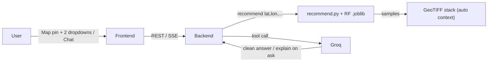

# AgroGuide — AI-Powered Agroecology CSA Practice Recommender

A decision-support web app for Climate-Smart Agriculture (CSA) in Ethiopia. A user
drops a **map pin**, picks a **challenge** and an **objective**, optionally names a
**crop**, and gets a short, clean list of recommended practices. A Groq LLM presents
it naturally and explains the evidence only when asked. **Every number comes from the
model — the LLM never invents figures.**



## What the user provides

| Input | Required |
|---|---|
| `lat`, `lon` (map pin or numbers; Ethiopia only) | ✅ |
| `practice_family` — "What challenge would you like to solve?" (5 options) | ✅ |
| `indicator` — "What is your objective?" (7 options) | ✅ |
| `crop_type` — optional | — |

Everything else (rainfall, altitude, slope, soil, agro-ecological zone …) is
auto-derived from the coordinates by sampling the raster stack — never typed.

## Quick start (local)

### 1. Backend

```bash
cd backend
python -m venv .venv
# Windows: .venv\Scripts\activate
pip install -r requirements.txt
cp .env.example .env          # optional: set OPENAI_API_KEY for OpenAI chat
uvicorn app.main:app --reload --port 8000
```

### 2. Frontend

```bash
cd frontend
cp .env.example .env.local
npm install
npm run dev
```

Open http://localhost:3000 — Chat at `/`, Finder at `/dashboard`.

### Docker

From the repo root:

```bash
# optional: export OPENAI_API_KEY=...
docker compose up --build
```

The small artifacts (model, dataset, zone lookup) are baked into the backend image;
the large GeoTIFF stack (`backend/layers/`, ~730 MB) is **mounted read-only** from the
host at `/srv/layers` (see `docker-compose.yml`). Startup fails fast if it's missing.

## Architecture

| Layer | Stack | Role |
|---|---|---|
| Engine | `backend/recommend.py`, `backend/groq_agent.py` | **Canonical** ML + agent logic — wrapped, never forked |
| `backend/app/` | FastAPI, Pydantic v2, rasterio, Groq | `/recommend`, `/chat` (SSE), `/metadata`, `/context`, `/health`, `/models` |
| `frontend/` | Next.js 15, Tailwind, react-leaflet, recharts | Map + form finder and chat; clean-by-default, details on demand |

## Honesty

The model is a pooled RandomForest over meta-analysis field evidence; grouped
cross-validated R² ≈ 0.19 (≈ the evidence mean). It's a **ranking** tool: the default
UI shows only the clean recommendation, and evidence counts / confidence exist to
justify a pick *on request*, not to decorate the answer. When evidence for an
objective is limited, the explanation says so.

## Tests

```bash
cd backend && pytest -q          # API + engine wrapper + offline chat
cd frontend && npm run test      # lib/util unit tests
```
